<!-- # Table of Contents
- [SRE Intro](#sre_intro)
  - [User Journey]
    - [User experience]
       - [Cloud computing with AWS]
        - [AWS Services]
  - [What is an SRE]
  - [Benefits of Cloud Computing]
  - [AWS Global Infrastructure]
  - [Regions vs Availability Zones]
  - [Four Pillars of Cloud Computing]
  - [What is CDN]
  - [ON-PREM vs HYBRID]
  - [ON-PREM vs PUBLIC CLOUD]
----------------------------
- [Connection between local host and public cloud (AWS)]
- [Local host]
- [Public cloud]
- [How to create AWS virtual machine (EC2 instance)]
- [How to connect to AWS through SSH and install nginx]
- [Amazon Machine Image (AMI)]
- [Linux Command]
- [File permissions]
- [Bash scripting - Automate process with the script]
- [Bash scripting - TomCat]
- [Technical Interview Preparation]
- [Monolith - N-tier - 2-tier & Microservices Architecture]
- [SRE Culture and CICD] -->

##### SRE Intro

- A group of people that makes sure that whatever is released doesn't crash, and if it does, it is their job to figure out why as quickly as possible so nothing needs to stop operations.

##### User Journey

##### User experience

##### Cloud computing with AWS

##### AWS Services

- Amazon Web Services (AWS)

##### Benefits of Cloud Computing

- Ease of use
  - don't need to think about buying a whole system, just rent one
  - no need to maintain it either, third-party handles it
- Flexibility
  - scalable
  - regions, availability zones
- Robustness
  - stored separately
- Cost
  - cheaper than in-prem
  - pay as you go

##### AWS Global Infrastructure

- An infrastructure of international data center regions, availability zones, CDNs and 200 more fully featured services.
- That provides an easy, secure and reliable cloud platform that is also dynamic and extensible.
- Most popular and used, holds the biggest market share currently

##### Regions vs Availability Zones

- Region is where the availability zones are located
- Availability zones is a data center that is managed on-site
- Multiple regions are more costly than multiple availability zones
- AZs are cheaper, but you must have at least two, in case there's a problem with one
  - or potentially lose users, time, and money
- Both regions and AZs can be autoscaled, which means if one doesn't work, another replaces it (after the switching)

##### Four Pillars of Cloud Computing

- Performance - scalable by adding nodes
- Security - both physical and virtual
- Reliability - many services offered, e.g. autoscaling, CDN
- Functionality

##### What is CDN

- Stands for Content Delivery Network
- The goal is to reduce latency for the end-user by making the connection spatially as close as possible
- It does so by caching content close to the user

##### ON-PREM vs HYBRID

- Hybrid cloud refers to a mix of on-prem storage, private cloud services and public cloud services such as AWS.
- more to add later

##### ON-PREM vs PUBLIC CLOUD

- On-prem is more secure and reliable but reliant on physical maintenance
- Public cloud removes responsibility and pressure of maintenance
  - it is also easily scalable

---------------------------------------

### Connection between local host and public cloud (AWS)

- requires permissions through roles, ports and keys

### Local Host

- local machine, desktop pc, laptop
- Stores file.pem (in .ssh folder) to access public cloud

### Public Cloud

- AWS
- Needs to be secure
  - Creates aws file.pem as SSH key
  - important, key is not shared with non-authorised parties
- we need to create a virtual machine on the cloud - ec2 (elastic compute service)
  - virtual machine similar to hardware - requires specific components

### How to create AWS virtual machine (EC2 instance)

##### 1. Log into your AWS account

##### 2. Select your desired Availability Zone

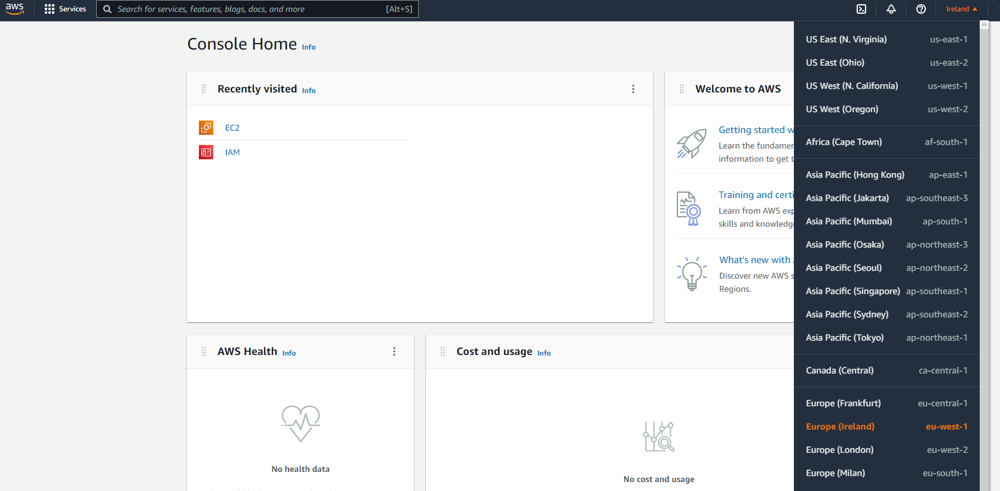

##### 3. Search and select EC2

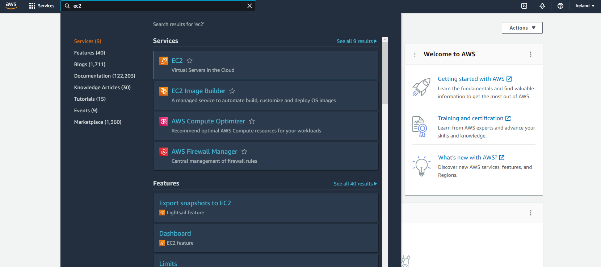

##### 4. Launch instance

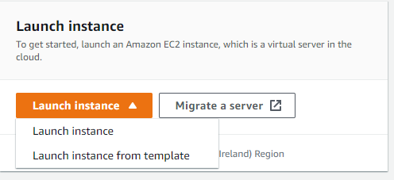

##### 5. Select AMI (Amazon Machine Image) - example Ubuntu Server 18.04 LTS

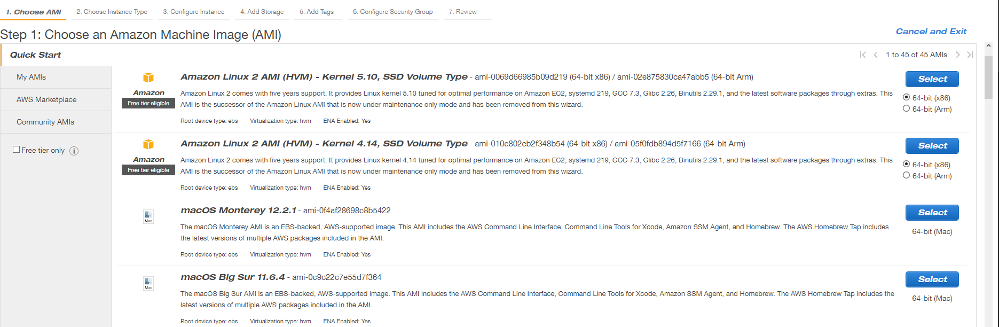

##### 6. Choose an Instance Type - example t2.micro

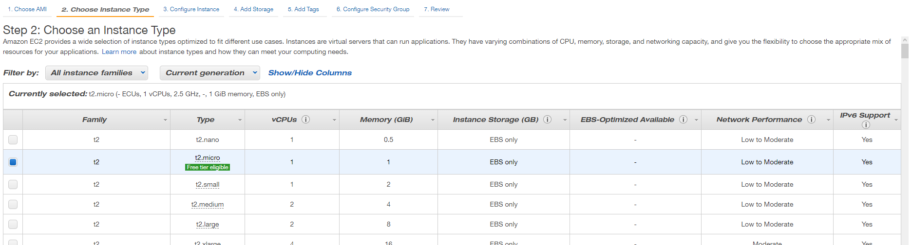

##### 7. Next: Configure Instance Details (network, subnet, auto-assign...)

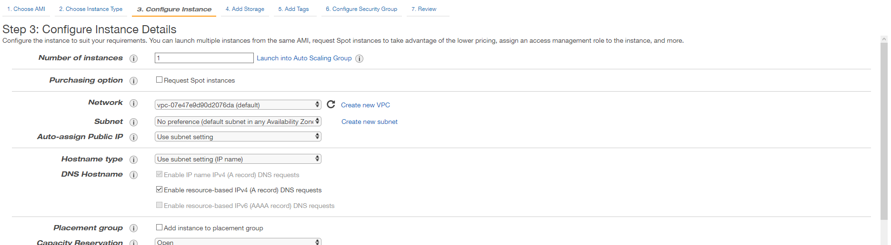

##### 8. Next: Add Storage

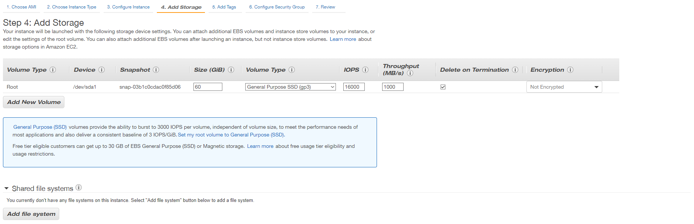

##### 9. Next: Add Tags

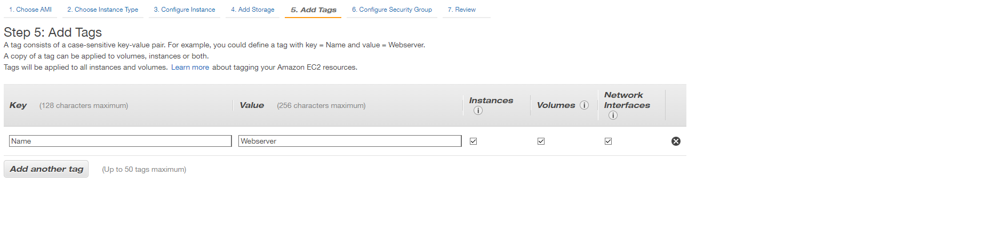

##### 10. Next: Configure Security Group

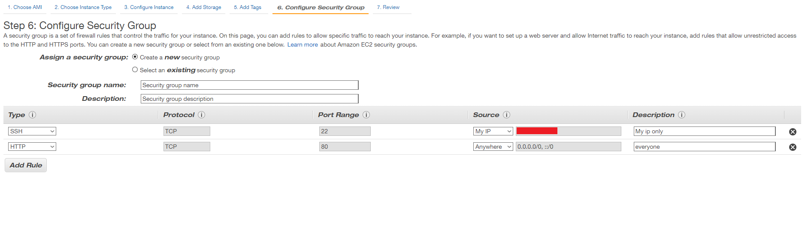

##### 11. Review and Launch


### How to connect to AWS through SSH and install nginx

##### 1. Open an SSH client (e.g. gitbash)

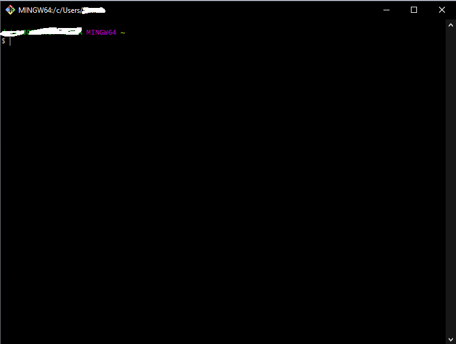

##### 2. Locate your private key file .pem

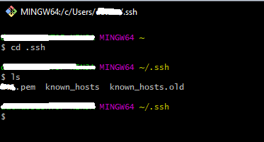

##### 3. Run command `chmod 400 filename` on the file to make it read-only

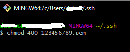

##### 4. Connect to instance using `ssh -i "filename.pem" user@dns`

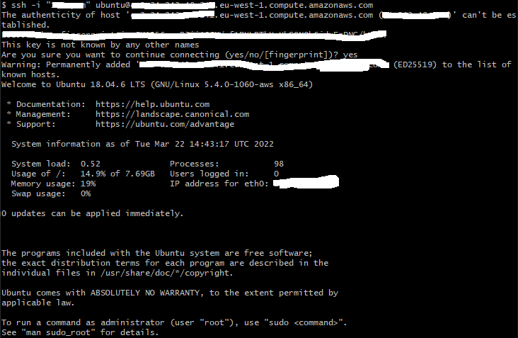

##### 5. After success, use command `sudo apt update` to fetch the list of available updates

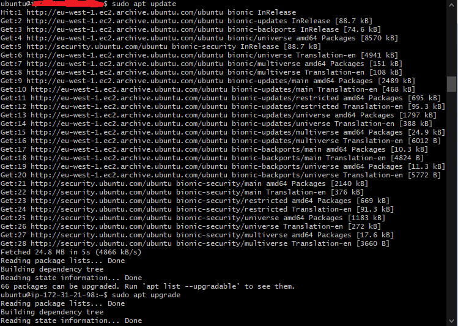

##### 6. Upgrade your server using `sudo apt upgrade`, it might take a while

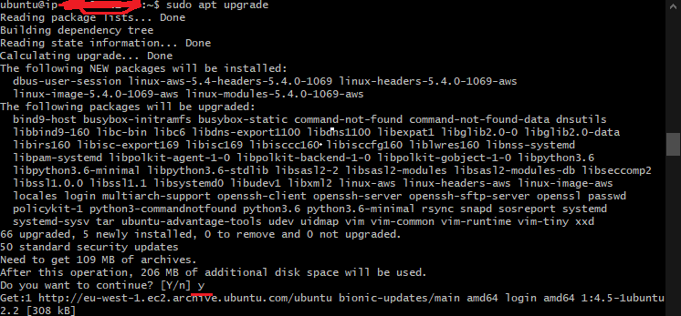

##### 7. Install nginx using `sudo apt install nginx` or `sudo apt-get install nginx`

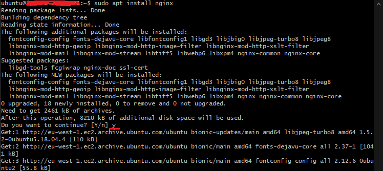

##### 8. Open browser and test public IP

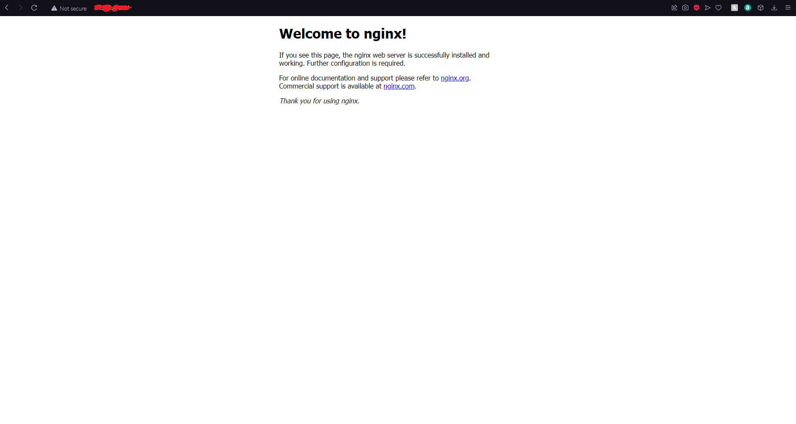

### Amazon Machine Image (AMI)

- A saved version of your instance, which you can safely terminate after

---------------------------------------

### Linux Command

- How to start a service `sudo systemctl start name_service`
- How to stop a service `sudo systemctl stop name_service`
- How to check status `systemctl status name_service`
- How to enable service `sudo systemctl enable name_service`
- How to install a package `sudo apt-get install package_name -y` or `sudo apt install package_name -y`
- How to remove a package `sudo apt remove package_name -y`
- How to check all process `top`
- Who am I `uname` or `uname -a`
- Where am I `pwd`
- Create a dir `mkdir dir_name`
- How to check `ls` or `ls -a`
- How to create a file `touch name_file` or `nano name_file`
- How to check content of the file witout going inside the file `cat name_file`
- How to move a file `mv file.txt "folder_destination"`
- How to copy a file `cp file.txt "folder_destination"`
- How to delete folder `sudo rm -rf name_folder`

### File permissions

- how to check a file permission `ll`
- change file permission `chmod required_permission file_name`
- write `w` read `r` exe `x`
- <https://chmod-calculator.com>

### Bash scripting - Automate process with the script

- code block

```bash
# create a file called provision.sh

# it must start with #!/bin/bash
#!/bin/bash

# run updates
sudo apt-get update -y
# run upgrades
sudo apt-get upgrade -y

# install nginx
sudo apt-get install nginx -y

# ensure it's running - start nginx
sudo systemctl start nginx

# enable nginx
sudo systemctl enable nginx
```

- change the file to exe `chmod +x provision.sh`
- how to run an exe file `./provision.sh`

### Bash scripting - TomCat

```bash
#before
#ensure port 8080 is enabled - in AWS, add new security group with inbound port 8080 open
#ensure this file has executable rights: chmod +x nameofthisfile
#run this file: sudo ./nameofthisfile

#actual script
#!/bin/bash

#get updates
sudo apt-get update -y
#get upgrades
sudo apt-get upgrade -y
#install tomcat9
sudo apt-get install tomcat9 -y
#start tomcat9
sudo systemctl start tomcat9
#enable tomcat9
sudo systemctl enable tomcat9
#check if running - optional, remember to ctrl+c to exit
sudo systemctl status tomcat9
```

---------------------------------------

### Technical Interview Preparation

##### What is a VPC

- Stands for Virtual Private Cloud
- Is a a secure, isolated private cloud hosted within a public cloud
- Advantages:
  - Scalability of public cloud computing
  - Data isolation of private cloud computing
  - Better performance, refer scalability
  - Better security overall
- Key technologies include:
  - Internet Gateway
  - Subnets
  - VLAN
  - VPN  
- examples: Amazon VPC (public is AWS), Google Cloud VPC

##### What is Internet Gateway

- A horizontally scaled, redundant and highly available VPC component, EC2 service
- Allows communication between VPC and internet
- For example, allows local computer to connect to EC2 instance
- Requirements:
  - Attached to VPC
  - Router(implicit) and Route tables (subnet)
  - Instances in subnet have a unique IP address
  - Network access control lists and security groups allow traffic

##### What is Route Tables

- A route table contains a set of rules, called *routes*
- Determines where network traffic from your subnet or internet gateway is directed
- Key concepts:
  - Main route table
  - Custom route table
  - Destination - range of IP addresses
  - Target - internet gateway, network interface, or connection
  - Subnet route table
- Each route in a table specifies a destination and a target

##### What is Subnet

- A range of IP addresses within a VPC
- Types: Ipv4 only, Ipv6 only, Both
- Can be public or private (with no internet gateway) or VPN only
- Example: Customer-facing web servers in public subnet, database servers in private subnet
- Uses NACLs to control traffic

##### What is NACLs

- Network access control lists
- An optional layer of security for your VPC
- Acts as firewall for controlling traffic in and out of one or more subnets
- Rules have priorities based on their rule number
- For each rule you have to specify:
  - Rule number, Type, Protocol, Port Range, Source/Destination, Allow/Deny

##### What is Security Group

- Acts as a virtual firewall, controlling in and out traffic of the instance
- A VPC comes with a default security group
- Characteristics:
  - Must have a name and a description
  - You can specify allow rules for inbound and outbound, but not deny
  - For each rule you have to specify Protocol, Port Range, Destination

##### NACLs vs Security Group

| Network ACL                  | Security group                 |
|------------------------------|--------------------------------|
| Operates at the subnet level | Operates at the instance level |
| Supports allow rules and deny rules | Supports allow rules only |
| Is stateless: Return traffic must be explicitly allowed by rules | Is stateful: Return traffic is automatically allowed, regardless of any rules|
| We process rules in order, starting with the lowest numbered rule, when deciding whether to allow traffic | We evaluate all rules before deciding whether to allow traffic |
| Automatically applies to all instances in the subnets that it's associated with (therefore, it provides an additional layer of defense if the security group rules are too permissive) | Applies to an instance only if someone specifies the security group when launching the instance, or associates the security group with the instance later on |

##### How did you secure your app on the public cloud

- Using security groups in our instances and setting inbound rules to allow specific traffic to come through

##### What are the outbound rules for security group by default? And why?

- It's set to All traffic, for Ipv4 and Ipv6.
- We want to ensure that there is outbound communication for our inbound connections.
- We are also less worried about exiting traffic than incoming traffic.

##### What is the command to kill a process in Linux

- `kill -9 <processId>` or `killall -9 process_name` (SIGKILL) - signal kill
- `kill -2 <processId>` or ctrl+c (SIGINT) - signal interrupt

----------------------------------------------------

### Monolith - N-tier - 2-tier & Microservices Architecture

##### Monolith

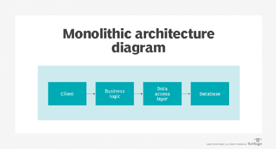

##### Microservices

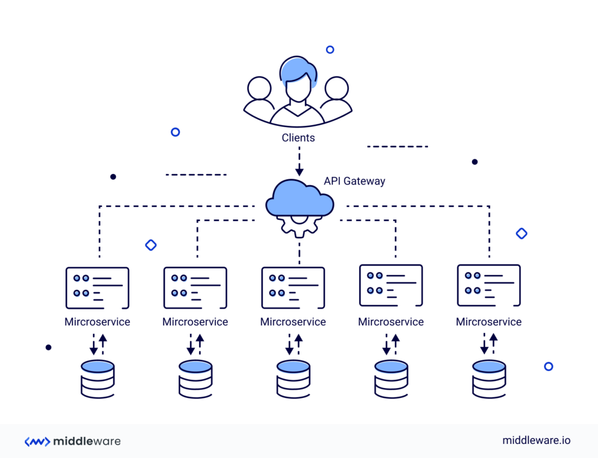
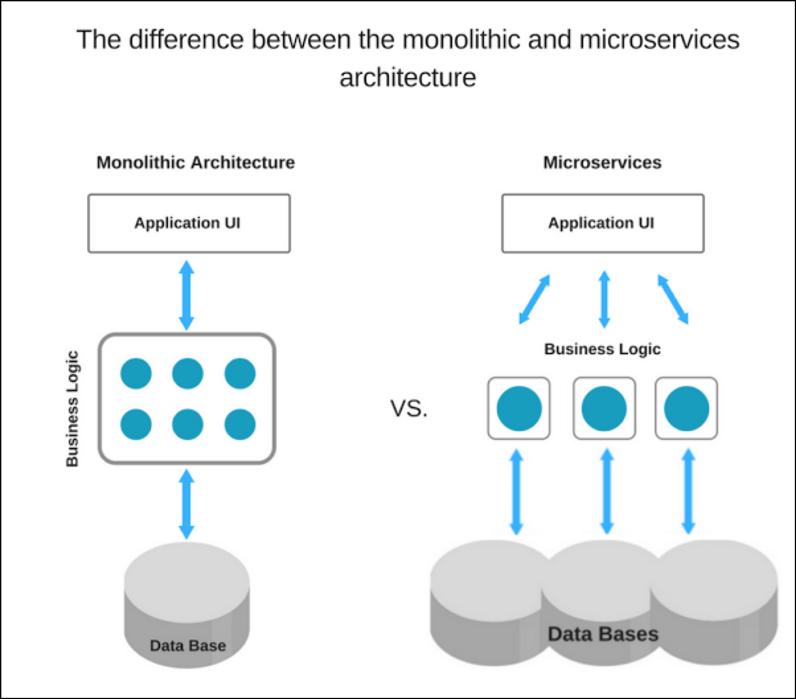

### SRE Culture and CICD

<https://medium.com/@ahshahkhan/devops-culture-and-cicd-3761cfc62450>

##### What is Docker

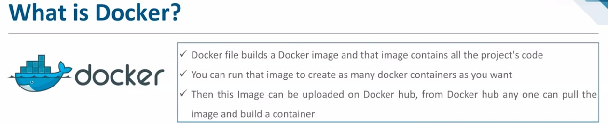

##### CICD

- a pipeline
- Benefits:
  - faster software builds
  - customer satisfaction by deploying the app in time
  - fault isolation simpler and quicker

##### Continuous Integration

- Automated test process
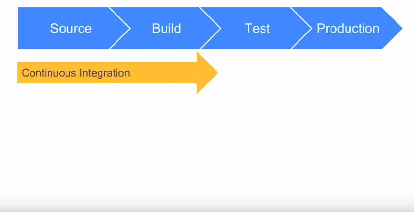

##### Continuous Delivery

- Automated release, manual deployment
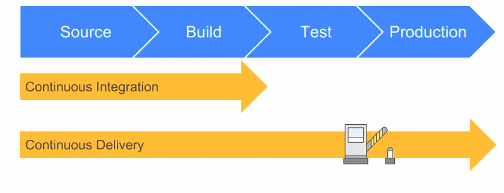

##### Continuous Deployment

- Automated deployment to customers
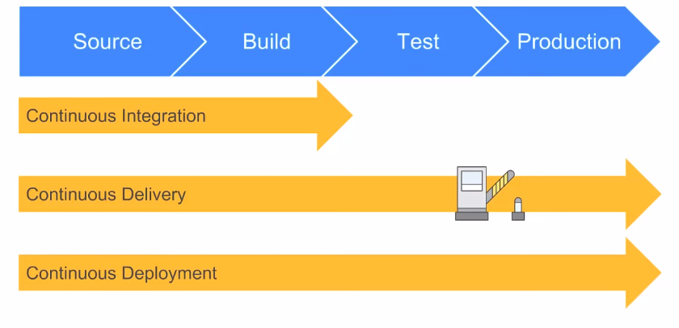

##### What is Jenkins

- Open-source Java-based CICD tool
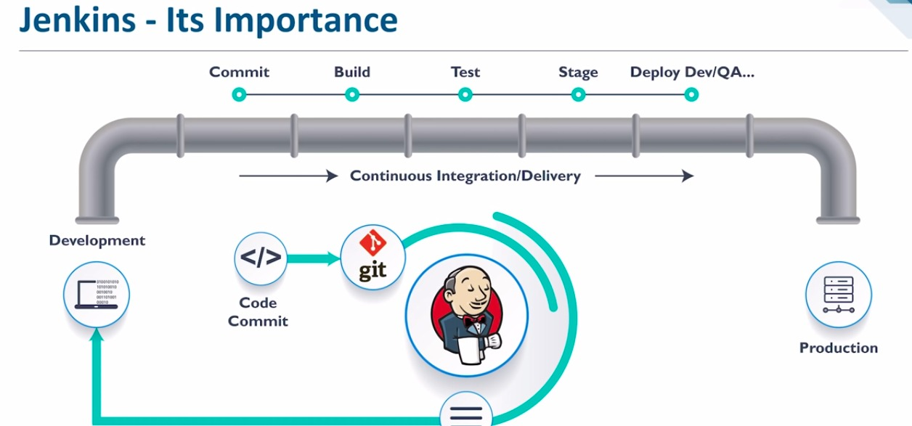

### SDLC - Software Development Lifecycle

- It’s the process of end to end product development.
- Products need to follow a certain life cycle.
- The Stages are:
  - Planning
  - Designing
  - Development
  - Testing
  - Staging

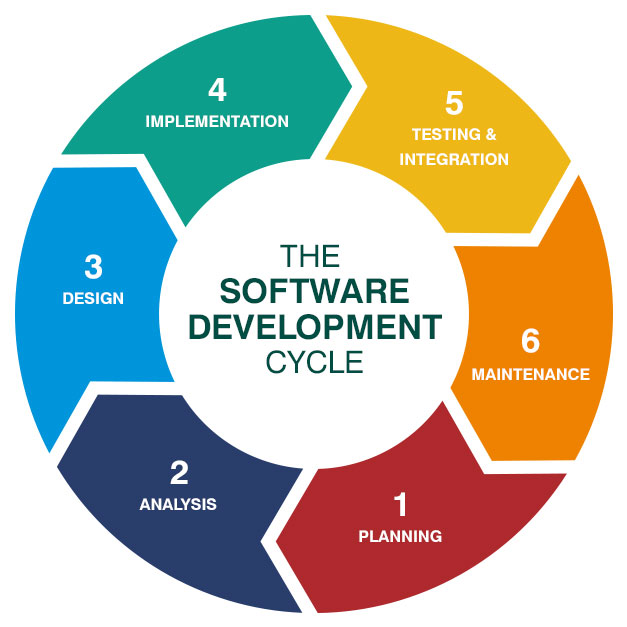

-------------------------------------

### Amazon S3 - Simple Storage Service

- Offers storage classes -  based on the data access, resiliency, and cost requirements of your workloads
- globally available = HIGHLY available
- Types:
  - Frequent
  - Infrequent
  - Archive
- Use cases:
  - Storage for Internet
  - Backup and Disaster Recovery
  - Analytics
  - Data Archiving
  - Static Website Hosting
  - Security and Compliance
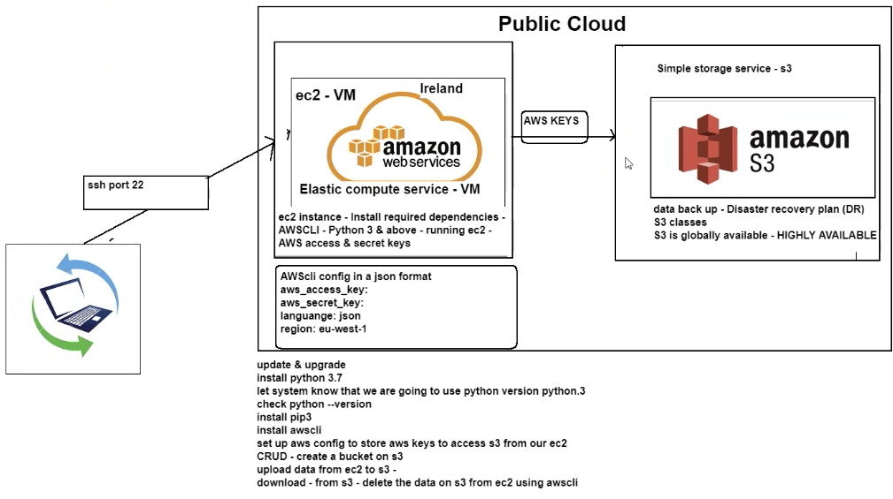

### AWSCLI S3 Tutorial

```bash
# update & upgrade
sudo apt update
sudo apt upgrade -y
# install python 3.7
sudo apt install python3
# let system know that we are going to use python version python.3
alias python=python3
# check python --version
python --version
# install pip3
sudo apt install python3-pip
# install awscli
sudo apt install awscli
python3 -m pip install awscli
# set up aws config to store aws keys to access s3 from our ec2
aws configure
# CRUD 
# create a bucket on s3
aws s3 mb s3://folder-name
# upload data from ec2 to s3 -
aws s3 cp data.dat s3://folder-name
# download - from s3 -
aws s3 cp s3://folder-name/data.dat /home/user
# delete the data on s3 from ec2 using awscli and delete bucket
aws s3 rm s3://folder-name/data.dat
aws s3 rb s3://folder-name
```

##### How to deploy an API with database in an EC2 instance (Ubuntu/Linux)

Requirements:

- AWS EC2 (t2.small)
- Ubuntu AMI
- Nginx installed
- API project + Database
- Gitbash, Postman (optional)
- Security gates:
  - SSH - 22
  - HTTP - 80
  - TCP - 5000
  - TCP - 5001
  - TCP - 1433
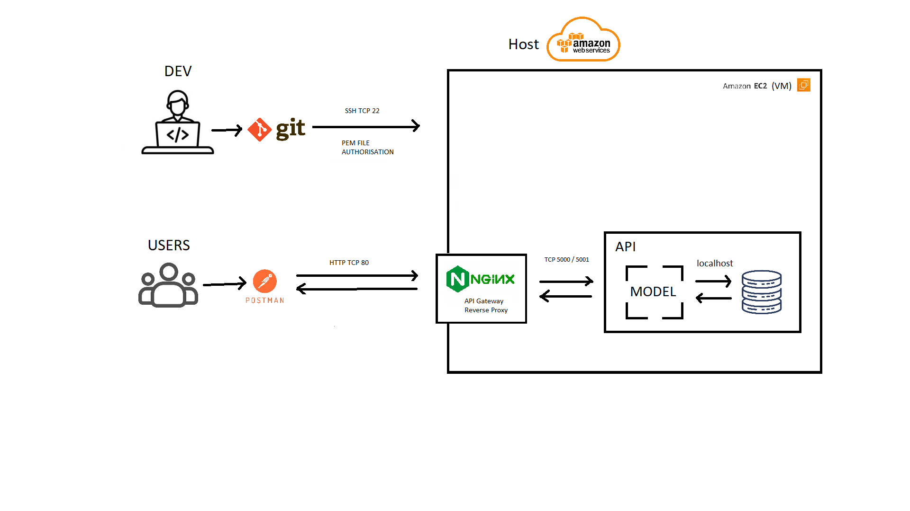


### What is Docker

- Open-source platform for containeristaion
- Platform-independent, runs on any OS
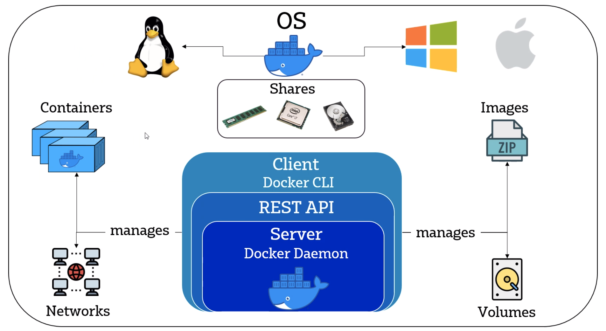

##### VM vs Docker

- Docker shares resources
- Container has its own network
- Create images and volumes
- Has its own Docker CLI, REST API, Docker machine
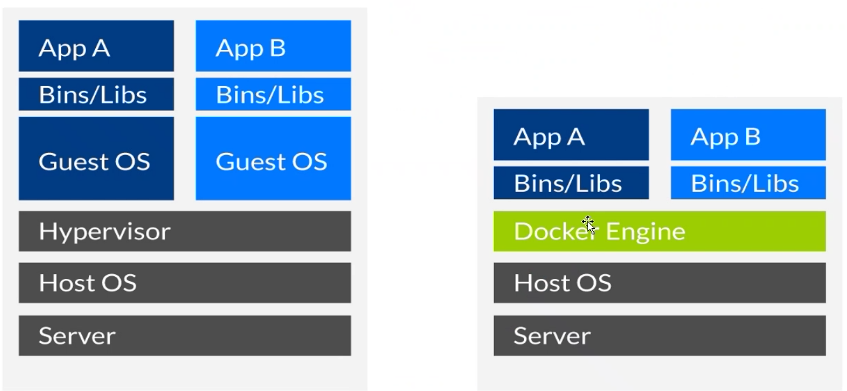

##### Why Docker...?

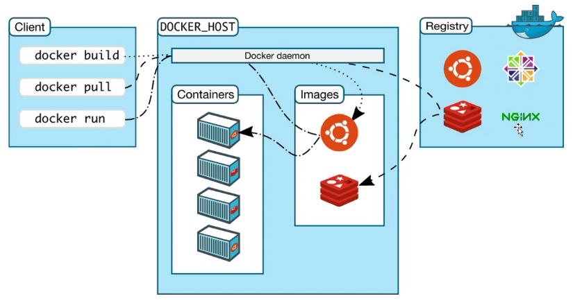

##### How to install Docker

For Windows: <https://docs.docker.com/desktop/windows/install/>

##### Docker commands

- `docker images`: shows all images available
- `docker pull <image_name>`: pull an image from docker hub
- `docker run -p <port:port> -d image_name`: run a container from an image (pull if necessary)
- `docker ps -a`: shows all containers
- `docker stop <container_name|container_id>`: stops the container
- `docker rm <container_name|container_id>`: removes the container
- `docker exec <container_name|container_id>`: access the running container
- `docker history <image_name>`: shows history
- `docker commit <container_name> <username/image_name>`: creates a new image from a container
- `docker push <username/image_name:version>`: pushes the images to the docker hub
- `docker image rm <image_name>`: deletes the image
- `docker run -d -p 4000:4000 docs/docker.github.io`: docker docks

### Let's do some exercises

##### How to change the NGINX homepage from our container

- First, we have to access our container, so we can make commands in it

```bash
alias docker="winpty docker" #(if on windows) 
docker exec -it <container_name|container_id> sh
```

- Then we have to navigate towards the folder where the homepage file resides.

```bash
cd usr/share/nginx/html
```

- Check if the index.html is in the folder.

```bash
ls
```

- Check the contents of the file and compare it to homepage, to make sure it's the right file.

```bash
cat index.html
```

- To edit the file, we will need to install nano.

```bash
apt-get update
apt-get install nano -y
```

- Edit the file using nano and make your desired changes.

```bash
nano index.html
# save using ctrl+x, y, enter
```

- Check the homepage and your changes should be visible!

##### How to make a global image out of your existing container

- First, you will need a Docker Hub account.

- Once you have your account, you can begin using docker commands.
- Commit your container and insert your account details, including the desired image name.

```bash
docker commit <container_name|container_id> <username/image_name>
```

- Push it the commited image (default version: latest).

```bash
docker push <username/image_name:version>
```

- Your container image should now be global and be accessed by anyone with the link.

- Let's test it out by removing our container first. Let's stop and remove it.

```bash
docker stop <container_name|container_id>
docker rm <container_name|container_id>
```

- Our container is now gone. Let's pull our container image.

```bash

docker pull <username/image_name:version>
```

- And run it.

```bash
docker run -d -p <port:port> <username/image_name:version>
```

- Check the port on your localhost and it should be identical!

### Docker Volumes

- Docker volumes are file systems mounted on Docker containers to preserve data generated by the running container.
- The volumes are stored on the host, independent of the container life cycle. This allows users to back up data and share file systems between containers easily.
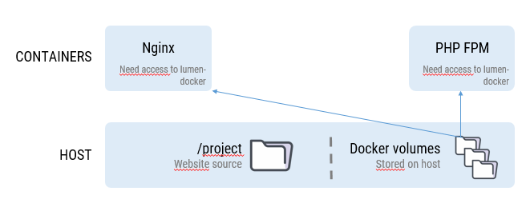

### Docker file to automate the process of building customised image - Building a Microservice with Docker

- Crio - Rocket - Docker
- Automate image building of our customised nginx
- create a `Dockerfile` in the same location where our index.html is
- Decide which base image to use for your image

### Test the image locally to ensure it works

- if all good then push to dockerhub

### How to build and run your API on Docker

```bash
# syntax=docker/dockerfile:1
FROM mcr.microsoft.com/dotnet/sdk:6.0 AS build
WORKDIR /"Employee(Controllers)"

# Copy csproj and restore as distinct layers
COPY *.csproj ./
RUN dotnet restore

# Copy everything else and build
COPY /. ./
RUN dotnet publish -c Release -o /app

# Build runtime image
FROM mcr.microsoft.com/dotnet/aspnet:6.0
WORKDIR /app
COPY --from=build /app ./
ENTRYPOINT ["dotnet", "Employee(Controllers).dll"]

# expose any necessary ports
EXPOSE 80
EXPOSE 5001
EXPOSE 5000
```

### Docker-Compose

Using Docker Compose is basically a three-step process:

1. Define your app's environment with a Dockerfile so it can be reproduced anywhere.

2. Define the services that make up your app in docker-compose.yml so they can be run together in an isolated environment.

3. Run `docker-compose up` and the Docker compose command starts and runs your entire app. Run docker compose build to update any changes to the docker compose file.

`docker-compose up`: to compose

Example:

```bash
version: '3.8'
services:
  db-server:
    image: tomasdat/northwind-db:latest
    environment:
      ACCEPT_EULA: "Y"
      SA_PASSWORD: "Password1!"
      MSSQL_PID: Developer
    ports:
      - "1433:1433"
  api:
    build: .
    ports:
      - "8080:80"
```

---

# Kubernetes

### Kubernetes why


### Kubernetes at peak

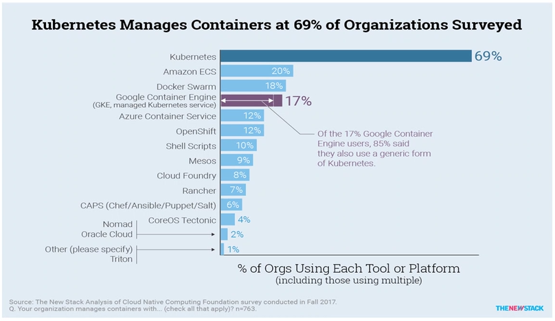

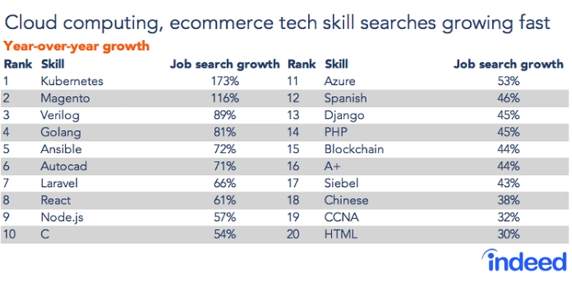

Kubernetes in action

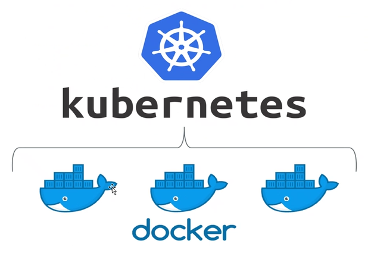

### Kubernetes Advantages

- Self Healing
- Load Balancing and Service Discovery
- Automated rollouts and rollback
- Auto Scaling
- Automatic bin packing
- Storage Orchestration

### Kubernetes Deployment Replicas = 3

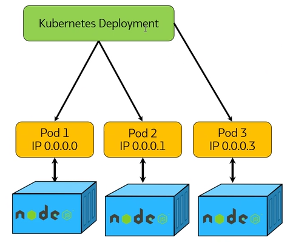

K8 commands

- `kubectl get all`: lists all services
- `kubectl get <service_types>`: lists all services of type
- `kubectl get <service_type> <service_name>`: show your service
- `kubectl describe <service_type> <service_name>`: gives details of service
- `kubectl create -f <file.yml>`: creates a service from YAML
- `kubectl delete <service_type> <service_name>`: deletes service
- `kubectl edit <service_type> <service_name>`: edit service

Official K8 Documentation - <https://kubernetes.io/docs/home/>

---

# YAML (Yet Another Markup Language):

### What is YAML?

- Yet Another Markup Language
- YAML Ain't Markup Language

### How to create a yml file

- file.yml or file.yaml

### How to declare it 
- Use `---`

### What are the use cases

- Can be utilised with K8, Docker-compose, Ansible, Cloud-formation
- To codify anything and everything in order to automate processes

### YAML exercise

```
create a deployment for nginx with 3 pods/containers
create a service - cluster-ip, NodePort - Loadbalancer
```

- create a folder called nginx-deploy / api
- create a file for nginx_deployment.yml / api
- create a file for nginx_svc.yml / api
- localhost:port

#### Deployment

```yaml
# K8 works with API versions to declare the resources

# YML is case sensitive -indentation of YML is important
# use spaces, not a tab
apiVersion: apps/v1
kind: Deployment # what kind of service/object you want to create

# what would you like to call it
metadata:
  name: api-deployment # naming the deployment

spec:
  selector:
    matchLabels:
      app: api # look for this label to match with k8 service
  
  # Let's create a replica set of this with 2 instaces/pods
  replicas: 3 

  # template to use it's label for K8 service to launch in the browser
  template:
    metadata:
      labels:
        app: api # this label connects to the service or any other k8 components
    
    # Let's define the container spec
    spec:
      containers:
      - name: api
        image: tomasdat/105_api_project
        ports:
        - containerPort: 80
```

#### Services
```yaml
# Select the type of API version and type of service/object
apiVersion: v1
kind: Service

# metadata for name
metadata:
  name: api-svc
  namespace: default #

# Specification to include ports Selector to connect to the deployment
spec:
  ports:
  - nodePort: 30442 # range is 30000-32768
    port: 81
    protocol: TCP
    targetPort: 80

  # Let's define the selector and label to connect to nginx deployment
  selector:
    app: api # this label connects this service to deployment

  # Creating LoadBalancer type of deployment
  type: LoadBalancer
```

API Cluster Diagram

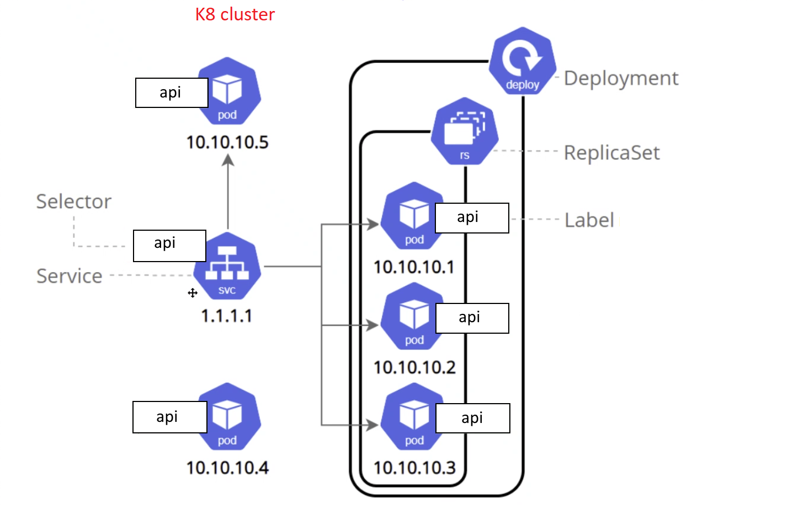