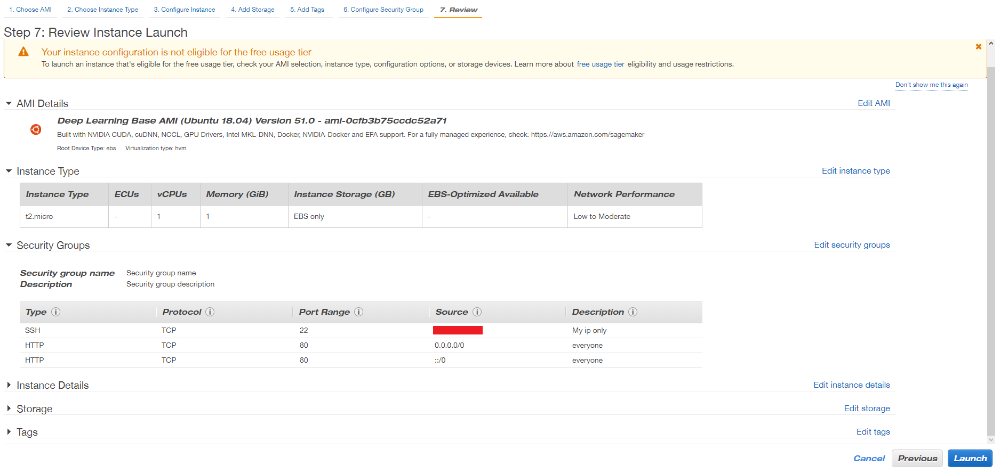

# SRE Intro
## User Journey
### User experience
#### Cloud computing with AWS
##### AWS Services

- creating github repo to to push the markdown doc
- Amazon Web Services (AWS)

### What is an SRE
A group of people that makes sure that whatever is released doesn't crash, and if it does, it is their job to figure out why as quickly as possible so nothing needs to stop operations.

### Benefits of Cloud Computing
- Ease of use
  - don't need to think about buying a whole system, just rent one
  - no need to maintain it either, third-party handles it
- Flexibility
  - scalable
  - regions, availability zones
- Robustness
  - stored separately
- Cost
  - cheaper than in-prem
  - pay as you go

### AWS Global Infrastructure
- An infrastructure of international data center regions, availability zones, CDNs and 200 more fully featured services.
- That provides an easy, secure and reliable cloud platform that is also dynamic and extensible.
- Most popular and used, holds the biggest market share currently

## Regions vs Availability Zones
- Region is where the availability zones are located
- Availability zones is a data center that is managed on-site
- Multiple regions are more costly than multiple availability zones
- AZs are cheaper, but you must have at least two, in case there's a problem with one
  - or potentially lose users, time, and money
- Both regions and AZs can be autoscaled, which means if one doesn't work, another replaces it (after the switching)

### Four Pillars of Cloud Computing
- Performance - scalable by adding nodes
- Security - both physical and virtual
- Reliability - many services offered, e.g. autoscaling, CDN
- Functionality

### What is CDN
- Stands for Content Delivery Network
- The goal is to reduce latency for the end-user by making the connection spatially as close as possible
- It does so by caching content close to the user

### ON-PREM vs HYBRID
- Hybrid cloud refers to a mix of on-prem storage, private cloud services and public cloud services such as AWS.
- more to add later

### ON-PREM vs PUBLIC CLOUD
- On-prem is more secure and reliable but reliant on physical maintenance
- Public cloud removes responsibility and pressure of maintenance
  - it is also easily scalable

### Connection between local host and public cloud (AWS)
- requires permissions through roles, ports and keys

### Local Host
- local machine, desktop pc, laptop
- Stores file.pem (in .ssh folder) to access public cloud

### Public Cloud
- AWS
- Needs to be secure
  - Creates aws file.pem as SSH key
  - important, key is not shared with non-authorised parties
- we need to create a virtual machine on the cloud - ec2 (elastic compute service)
  - virtual machine similar to hardware - requires specific components

### How to create AWS virtual machine (EC2 instance)
##### 1. Log into your AWS account
##### 2. Select your desired Availability Zone

##### 3. Search and select EC2

##### 4. Launch instance

##### 5. Select AMI (Amazon Machine Image) - example Ubuntu Server 18.04 LTS

##### 6. Choose an Instance Type - example t2.micro

##### 7. Next: Configure Instance Details (network, subnet, auto-assign...)

##### 8. Next: Add Storage

##### 9. Next: Add Tags

##### 10. Next: Configure Security Group

##### 11. Review and Launch


### How to connect to AWS through SSH and install nginx
##### 1. Open an SSH client (e.g. gitbash)

##### 2. Locate your private key file .pem

##### 3. Run command `chmod 400 filename` on the file to make it read-only

##### 4. Connect to instance using `ssh -i "filename.pem" user@dns`

##### 5. After success, use command `sudo apt update` to fetch the list of available updates

##### 6. Upgrade your server using `sudo apt upgrade`, it might take a while

##### 7. Install nginx using `sudo apt install nginx` or `sudo apt-get install nginx`

##### 8. Open browser and test public IP


### Amazon Machine Image (AMI)
- A saved version of your instance, which you can safely terminate after

### Linux Command
- How to start a service `sudo systemctl start name_service`
- How to stop a service `sudo systemctl stop name_service`
- How to check status `systemctl status name_service`
- How to enable service `sudo systemctl enable name_service`
- How to install a package `sudo apt-get install package_name -y` or `sudo apt install package_name -y`
- How to remove a package `sudo apt remove package_name -y`
- How to check all process `top`
- Who am I `uname` or `uname -a`
- Where am I `pwd`
- Create a dir `mkdir dir_name`
- How to check `ls` or `ls -a`
- How to create a file `touch name_file` or `nano name_file`
- How to check content of the file witout going inside the file `cat name_file`
- How to move a file `mv file.txt "folder_destination"`
- How to copy a file `cp file.txt "folder_destination"`
- How to delete folder `sudo rm -rf name_folder`

### File permissions
- how to check a file permission `ll`
- change file permission `chmod required_permission file_name`
- write `w` read `r` exe `x`
- https://chmod-calculator.com

### Bash scripting - Automate process with the script

- code block
```bash
# create a file called provision.sh

# it must start with #!/bin/bash
#!/bin/bash

# run updates
sudo apt-get update -y
# run upgrades
sudo apt-get upgrade -y

# install nginx
sudo apt-get install nginx -y

# ensure it's running - start nginx
sudo systemctl start nginx

# enable nginx
sudo systemctl enable nginx
```

- change the file to exe `chmod +x provision.sh`
- how to run an exe file `./provision.sh`

